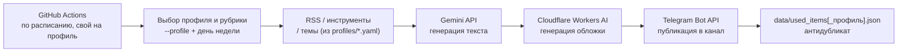

<div align="center">

# Prompty Engine

**Мульти-канальный автопостинг для Telegram**

Один код — сколько угодно каналов в разных нишах, каждый сам пишет,
оформляет и публикует себя


</div>

---

Открытый пайплайн автопостинга для Telegram-каналов. Раз в день (или чаще)
бот сам выбирает тему, пишет пост нейросетью, рисует для него обложку и
публикует в канал — без единой ручной правки и без единого платного
сервиса. Архитектура **мульти-профильная**: один и тот же код ведёт сразу
несколько разных каналов в разных нишах — у каждого свой конфиг (рубрики,
тон, источники), но общая инфраструктура.

## Активные каналы (профили)

| Профиль | Канал | Ниша |
|---|---|---|
| `prompty` | Prompty | ИИ-инструменты для маркетинга и малого бизнеса |
| `savings` | Копейка | Экономия денег и защита прав потребителя |

Оба запущены как параллельный пилот — сравниваем, какая ниша реально
набирает аудиторию, прежде чем вкладывать бюджет в продвижение только
одной. Подробности — в [`GUIDE.md`](./GUIDE.md).

## Возможности

- **Полный автопилот** — от идеи до публикации без участия человека
- **Мульти-профиль** — новый канал в новой нише = новый yaml-файл, без изменения кода
- **7 рубрик** на каждый день недели: новости, инструменты, шаблоны/промпты, кейсы, дайджест, опрос, факты
- **Фокус на RU-аудитории** — без мультиязычности, весь стек и контент под русскоязычный Telegram
- **Антидубликат** — история публикаций на каждый профиль своя, не даёт повторить один и тот же пост
- **Нулевая стоимость** — весь стек работает на бесплатных тарифах

## Как это работает



## Технологии

| Задача | Инструмент | Стоимость |
|---|---|---|
| Генерация текста | [Gemini API](https://aistudio.google.com/apikey) (`gemini-3.1-flash-lite`) | Бесплатно |
| Генерация обложек | [Cloudflare Workers AI](https://dash.cloudflare.com) (`flux-1-schnell`) | Бесплатно, ~230 img/день |
| Публикация | Telegram Bot API | Бесплатно |
| Расписание/раннер | GitHub Actions | Бесплатно |

## Структура проекта

```text
profiles/
├── prompty.yaml               # профиль канала Prompty (ИИ для маркетинга/бизнеса)
└── savings.yaml               # профиль канала Копейка (экономия/права потребителя)
src/
├── config.py                  # загрузка .env + profiles/<профиль>.yaml
├── sources.py                  # получение новостей из RSS
├── dedup.py                    # история опубликованного (антидубликат, отдельно на профиль)
├── generator.py                 # промпты и вызов Gemini API
├── images.py                   # генерация обложки через Cloudflare Workers AI
├── telegram_client.py           # публикация в Telegram Bot API
└── main.py                     # оркестрация: профиль → рубрика → генерация → публикация
data/
├── used_items.json            # история публикаций Prompty
└── used_items_savings.json    # история публикаций Копейки
.github/workflows/
├── post-prompty.yml           # расписание автопостинга Prompty
└── post-savings.yml           # расписание автопостинга Копейки
```

## Быстрый старт

```bash
cp .env.example .env                        # заполнить токены (Telegram, Gemini)
pip install -r requirements.txt
python -m src.main --profile prompty --dry-run   # проверить генерацию без публикации
python -m src.main --profile savings --dry-run
```

Полная инструкция по запуску, настройке GitHub Actions, добавлению нового
профиля и контент-план — в [`GUIDE.md`](./GUIDE.md).
