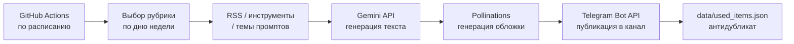

<div align="center">

# Prompty

**Нейросети и ИИ простыми словами**

Telegram-канал, который сам пишет, оформляет и публикует себя


</div>

---

**Prompty** — открытый пайплайн автопостинга для Telegram-канала об ИИ.
Раз в день (или чаще) бот сам выбирает тему, пишет пост нейросетью, рисует
для него обложку и публикует в канал — без единой ручной правки и без
единого платного сервиса.

## Возможности

- **Полный автопилот** — от идеи до публикации без участия человека
- **7 рубрик** на каждый день недели: новости, инструменты, промпты, кейсы, дайджест, опрос, факты
- **Мультиязычность** — опциональный второй канал на английском с автопереводом каждого поста и той же обложкой
- **Антидубликат** — история публикаций не даёт повторить один и тот же пост
- **Нулевая стоимость** — весь стек работает на бесплатных тарифах
- **Гибкая настройка** — рубрики, тон, источники и частота меняются в одном конфиге

## Как это работает



## Технологии

| Задача | Инструмент | Стоимость |
|---|---|---|
| Генерация текста | [Gemini API](https://aistudio.google.com/apikey) (`gemini-3.1-flash-lite`) | Бесплатно |
| Генерация обложек | [Pollinations.ai](https://pollinations.ai) | Бесплатно, без ключа |
| Публикация | Telegram Bot API | Бесплатно |
| Расписание/раннер | GitHub Actions | Бесплатно |

## Структура проекта

```text
config.yaml                 # рубрики по дням, RSS-фиды, инструменты, темы промптов
src/
├── config.py                # загрузка .env + config.yaml
├── sources.py                # получение новостей из RSS
├── dedup.py                  # история опубликованного (антидубликат)
├── generator.py               # промпты и вызов Gemini API
├── images.py                 # генерация обложки через Pollinations
├── telegram_client.py         # публикация в Telegram Bot API
└── main.py                   # оркестрация: рубрика → генерация → публикация
data/used_items.json        # история опубликованного (коммитится автоматически)
.github/workflows/post.yml  # расписание автопостинга
```

## Быстрый старт

```bash
cp .env.example .env          # заполнить токены (Telegram, Gemini)
pip install -r requirements.txt
python -m src.main --dry-run  # проверить генерацию без публикации
```

Полная инструкция по запуску, настройке GitHub Actions и контент-план —
в [`GUIDE.md`](./GUIDE.md).
